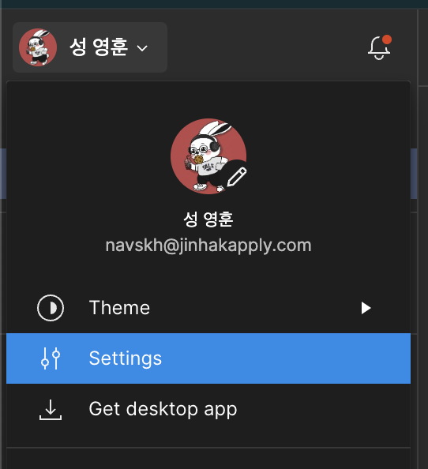
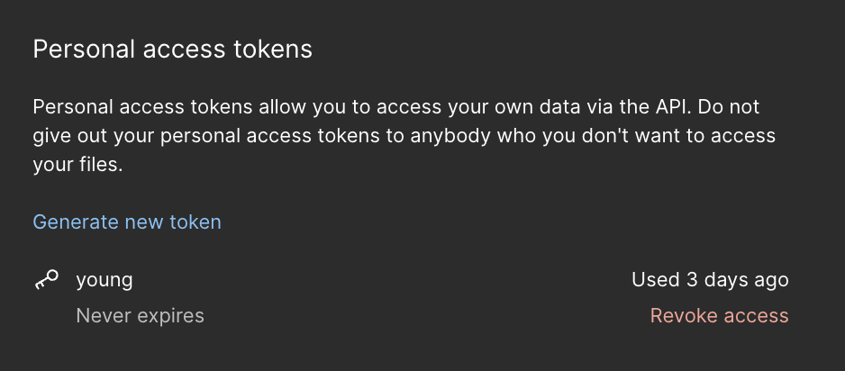

## Figma API 사용하여 디자인 엘리먼트 가져오기

지난 시간 디자인 시스템에 관련된 사항을 정리하였는데

이 때 이야기 하였던 Figma API를 사용하여 디자인 산출물을 HTML 코드로 변환해주는 작업을 해보려 합니다.

## 만들어보자!

Figma API를 사용하기 위해서는 Figma 계정의 토큰이 필요합니다.



Fimga의 계정에서  Settings 에 들어갑니다.



아래 처럼 Personal Access token을 발행할 수 있습니다.

```javascript 
const fileKey = 'file key';
const personalAccessToken = 'personal access token';

// Figma API 엔드포인트
const url = `https://api.figma.com/v1/files/${fileKey}`;

// Define your API endpoint
router.get('/design', async (req, res) => {
  try {
    console.log('call!');
    // Make a request to the Figma API to fetch design elements
    const response = await axios.get(url, {
      headers: {
        'X-Figma-Token': personalAccessToken
      }
    });

    const data = response.data;
    // targetFrame 찾기 
    const targetChildren = data.document.children;
    const targetPage = targetChildren.find((page) => page.name === '원하는 페이지');
    const targetFrame = targetPage.children.find((frame) => frame.name === '원하는 프레임');
    const instanceGroup = targetFrame.children.filter(ele => ele.type === 'INSTANCE').map(ele => ele.name);

    // instanceGroup 의 각각을 html 로 변환해주기 
    const html = convertHTML(instanceGroup.reverse());
    fs.writeFile('./src/html/myNewFile.html', html, (err) => {
      if (err) throw err;
      console.log('The file has been saved!');
    });
    res.send('html make success!');

  } catch (error) {
    // Handle any errors that occur during the request
    console.error(error);
    res.status(500).json({ error: 'An error occurred' });
  }
});
```

위와 같이 node로 REST API를 만들어서 사용하였습니다.

/design이라는 경로로 들어오면 내가 원하는 페이지의 원하는 프레임의 엘리먼트 정보를 name으로 받아서

해당하는 name 값들을 디자인 시스템에 정한 html로 변환하여
뭉쳐주는 작업을 진행합니다.

뭉쳐준 html 결과물을 .html 파일로 저장 한 후 확인하면

동일한 결과물이 나오는 것을 확인할 수 있습니다.

다만, 여기서는 name값만 가져오도록 만들었는데

점차, 추가적으로 property 값 등을 가져와서 수정할 수 있도록 해야겠습니다.

