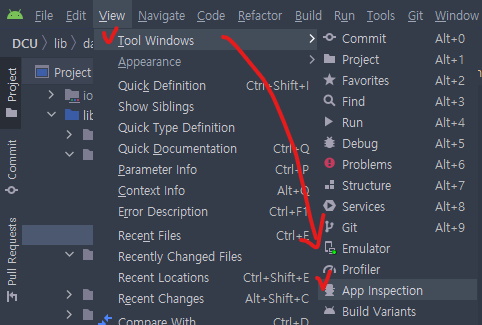
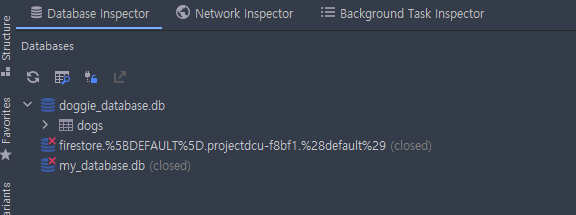
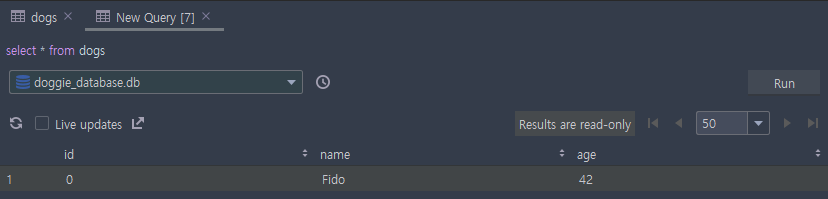

# sqflite 패키지 사용법

#### Author: Young
#### 2022-08-12

---
## sqflite 패키지 설치


  
**최신 버전 : 2.0.3+1 (2022-08-10 기준)**

---

## path 패키지 설치 

내부 데이터베이스의 위치를 정확히 정의해 주는 패키지.


최신 버전 : 1.8.2 그러나 호환을 위해 1.8.1로 설치

---


## pub get

당연하게도 pub get을 해준다.

```yaml
  sqflite: ^2.0.3+1
  path: ^1.8.1
```

---

## 소스먼저

### DogHelper class 를 만들거야 (Create Table)

```dart
import 'package:path/path.dart';
import 'package:sqflite/sqflite.dart';

class DogHelper{
  Future start() async { // start 함수 사용하면 디비랑 테이블을 만들어줌.
    final databasePath = await getDatabasesPath();
    String path = join(databasePath, 'doggie_database.db');

    final database = await openDatabase(
      path,
      version: 1,
      onCreate: (db, version) {
        return db.execute( // Create
          "CREATE TABLE dogs(id INTEGER PRIMARY KEY, name TEXT, age INTEGER)",
        );
      }
    );
```

---

### Insert 하기

```dart
Future<void> insertDog(Dog dog) async {
      // 데이터베이스 reference를 얻습니다.
      final Database db = await database;

      // Dog를 올바른 테이블에 추가하세요. 또한
      // `conflictAlgorithm`을 명시할 것입니다. 본 예제에서는
      // 만약 동일한 dog가 여러번 추가되면, 이전 데이터를 덮어쓸 것입니다.
      await db.insert(
        'dogs',
        dog.toMap(),
        conflictAlgorithm: ConflictAlgorithm.replace,
      );
    }
```
---

### Update 하기
```dart
    Future<void> updateDog(Dog dog) async {
      // 데이터베이스 reference를 얻습니다.
      final db = await database;

      // 주어진 Dog를 수정합니다.
      await db.update(
        'dogs',
        dog.toMap(),
        // Dog의 id가 일치하는 지 확인합니다.
        where: "id = ?",
        // Dog의 id를 whereArg로 넘겨 SQL injection을 방지합니다.
        whereArgs: [dog.id],
      );
    }
```
---
### Delete 하기
```dart
Future<void> deleteDog(int id) async {
      // 데이터베이스 reference를 얻습니다.
      final db = await database;

      // 데이터베이스에서 Dog를 삭제합니다.
      await db.delete(
        'dogs',
        // 특정 dog를 제거하기 위해 `where` 절을 사용하세요
        where: "id = ?",
        // Dog의 id를 where의 인자로 넘겨 SQL injection을 방지합니다.
        whereArgs: [id],
      );
    }
```
---
### Select 하기

```dart
Future<List<Dog>> dogs() async {
      // 데이터베이스 reference를 얻습니다.
      final Database db = await database;

      // 모든 Dog를 얻기 위해 테이블에 질의합니다.
      final List<Map<String, dynamic>> maps = await db.query('dogs');

      // List<Map<String, dynamic>를 List<Dog>으로 변환합니다.
      return List.generate(maps.length, (i) {
        return Dog(
          id: maps[i]['id'],
          name: maps[i]['name'],
          age: maps[i]['age'],
        );
      });
    }
```
---
## Dog class 만들기
```dart
class Dog {
  final int id;
  final String name;
  final int age;

  Dog({required this.id,required this.name,required this.age});

  Map<String, dynamic> toMap() {
    return {
      'id': id,
      'name': name,
      'age': age,
    };
  }

  // 각 dog 정보를 보기 쉽도록 print 문을 사용하여 toString을 구현하세요
  @override
  String toString() {
    return 'Dog{id: $id, name: $name, age: $age}';
  }
}
```
---
## Dog Instance 만들고 사용
```dart
    var fido = Dog(id: 0,name: 'Fido',age: 35,);

    // 데이터베이스에 dog를 추가합니다.
    await insertDog(fido);

    // dog 목록을 출력합니다. (지금은 Fido만 존재합니다.)
    print(await dogs());

    // Fido의 나이를 수정한 뒤 데이터베이스에 저장합니다.
    fido = Dog(id: fido.id,name: fido.name,age: fido.age + 7,);
    await updateDog(fido);

    // Fido의 수정된 정보를 출력합니다.
    print(await dogs());

    // Fido를 데이터베이스에서 제거합니다.
    // await deleteDog(fido.id);

    // dog 목록을 출력합니다. (비어있습니다.)
    print(await dogs());

    // 결과
    //I/flutter (18925): [Dog{id: 0, name: Fido, age: 35}]
    //I/flutter (18925): [Dog{id: 0, name: Fido, age: 42}]
    //I/flutter (18925): [Dog{id: 0, name: Fido, age: 42}]
```
---
## 데이터베이스 inspector 사용하는 방법 -1

#### View > Tool Windows > App Inspection 선택



#### 참고
1. sqflite 패키지는 웹에서는 사용할 수 없다.
2. App Inspection 안에 들어가야 볼 수 있다.

---

## 데이터베이스 inspector 사용하는 방법 -2

#### App Inspection 클릭 시 


#### Query 도 사용할 수 있음


---

## 추가 관련 사항

진행하면서 간과한 사항이 있었다.

앱 Inspection 에서만 SQL을 사용할 수 있는데(웹에선 x)

우리 backend는 회사에서 host 타고 웹으로만 접속할 수 있음.

앱 vm으로는 host를 읽지 못하므로 backend 데이터를 가져올 수 없음

#### 결론: BackEnd Real 배포를 해야하는 상황
