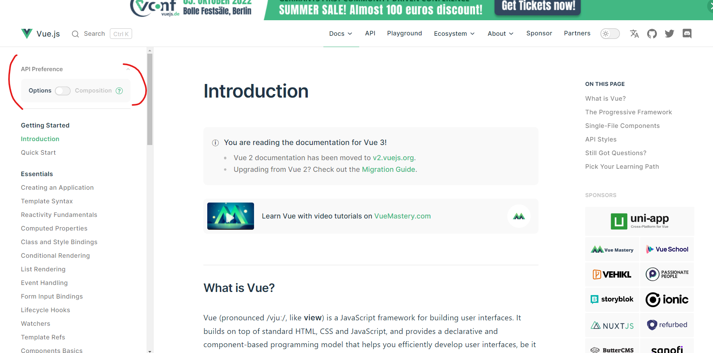

## Vite를 사용하여 빌드할 거야!
이점 : 전체 모듈을 매번 번들링하는 것이 아니라
변경된 모듈만 교체하기 때문에 개발을 빠르게 진행할 수 있다.

```
npm init vue

.. 여러 설정 yes/no로 넘어감
.. ESLint/Prettier 만 Yes

# 해당 디렉토리로 가서
npm i

```


## ESLint, Prettier 설정

### vite.config.ts
```ts
// https://vitejs.dev/config/
export default defineConfig({
  plugins: [vue()],
  resolve: {
    alias: {
      '@': fileURLToPath(new URL('./src', import.meta.url))
    }
  }
})
```

alias 설정 : 파일시스템 경로의 별칭을 설정할 때 사용

```js
// main.js
import { createApp } from 'vue'
import App from './App.vue'

import './assets/main.css'

createApp(App).mount('#app')

```

createApp 을 app 이라는 아이디에 렌더링 해라

index.html 은 div 태그의 아이디가 app으로 되어있음.

### ESLint 설정
코드 컨벤션은 굉장히 중요함.

style-guide 특정 패턴으로 개발하면 굉장히 유용하다.

```js
/* eslint-env node */
require("@rushstack/eslint-patch/modern-module-resolution");

module.exports = {
  "root": true,
  "extends": [
    "plugin:vue/vue3-essential",
    "eslint:recommended",
    "@vue/eslint-config-prettier"
  ]
}

```

1. 컴포넌트 이름을 사용할 땐 합성어로 사용하라.
2. props를 설정할 때도 배열로 하기보다 객체로 만드는것이 상세하다.


``` "eslint:recommended", ```

ESLint의 추천 항목을 자동으로 검사해라.

``` "@vue/eslint-config-prettier", ```

충돌 방지 옵션임.

ESLint Rules 관련 정보
https://eslint.org/docs/latest/rules/

다양한 규칙이 있음.
```js
  rules: {
    "no-console": process.env.NODE_ENV === "production" ? "error" : "off",
  },
```
위와 같이 만들 수 있는데 
error 말고도
- warn (경고창만 띄움)
- off (사용 안함)

을 사용할 수 있다.

```js
rules: {
    "no-console": process.env.NODE_ENV === "production" ? "error" : "off",
    "prettier/prettier" : ["error", {
      프리티어 룰들 적용
    }]
```

```json
//settins.json
  "eslint.validate": [
    "javascript",
    "typescript",
    "vue",
    "html",
    "markdown"
  ],
  "editor.codeActionsOnSave": {
    singleQuote: true,
    semi: true,
    useTabs: true,
    tabWidth: 2,
    trailingComma: 'all',
    printWidth: 80,
    bracketSpacing: true,
    arrowParens: 'avoid',
  },
```
이런식으로 하면 eslint 활성화 되는 언어 지정 가능
그리고 vscode를 저장할 때 eslint를 적용해라라는 옵션임.

반드시 format on save 옵션은 해제해줘야 함
(prettier 플러그인이 있다면 끄는것이 좋을 수 있음)

이렇게만 하면 사용할 수 있음!

npm run lint를 통해 전체 파일에 lint 진행을 할 수 있다.

## Options API vs Composition API
Vue2 에서 : Options API
Vue3 에서 : Composition API

결론적으론 Composition API가 너무 좋다.

Composition API 기반의 강좌가 진행이 될 것임

Options API 와 Composition API 의 차이

Options API 예시 코드
```vue
<template>
	<div>
		<button v-on:click="increment">Counter {{ counter }}</button>
	</div>
</template>

<script>
export default {
	data() {
		return {
			counter: 0,
		};
	},

	methods: {
		increment() {
			this.counter++;
		},
	},
};
</script>

<style></style>

```

Composition API의 예제

```vue
<template>
	<div>
		<button v-on:click="increment">Counter {{ counter }}</button>
	</div>
</template>

<script>
import { onMounted, ref } from 'vue';
export default {
	setup() {
		const counter = ref(0);
		const increment = () => counter.value++;

		onMounted(() => {
			console.log('마운트!');
		});
		return {
			counter,
			increment,
		};
	},
};
</script>

<style></style>
```

두개가 어떻게 다르냐..
Options API
data, methods, mounted  나뉘어 있음

Composition API 
setup() 안에
다 모여있음.

옵션을 선언한 대신
ref, onMounted  등등 
Vue 컴포넌트를 작성할 수 있는 API 세트..

### 왜? Composition API 인가

원래 Options API 를 보면
data, 메서드가 다 나눠져 있음.

그러나 Composition api를 사용하면
관련 데이터, 메서드 등을 모아둘 수 있음
그러면 논리적으로 상당히 괜찮을 수 있음

그러면 하나의 .js 파일로 만들 수도 있음.

논리적 관심사가 같은 애들끼리 모여있게 됨.

오 진짜 괜찮다.

코드의 재사용을 할 수 있는 애들은
Composable 이라고 하는 애라고 한다.
그러면 Mixin도 사용할 필요가 없음.

**Composable을 사용하여 코드 재사용을 쉽게 할 수 있다.**

#### Options API 와의 관계
- 기존 OptionsAPI 의 대부분을 대체한다.
- 두개 함께 사용도 가능하다.
- 그래도 그냥 Composition API 로만 개발하는 것이 좋다.


vue 공식 문서상의 좌측에 보면 사용하는 api 별로 선택해서 확인할 수 있으니 참고할 것.
